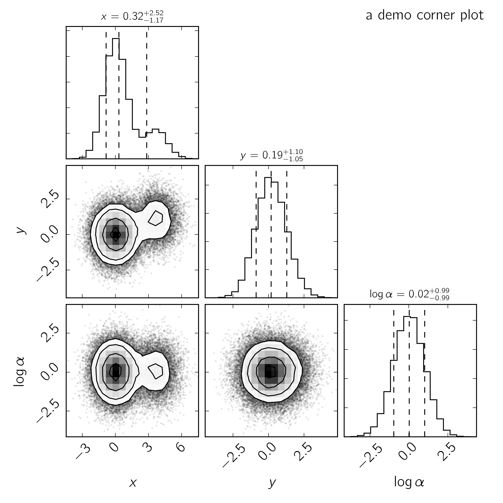

corner.py
=========

.. image:: http://img.shields.io/travis/dfm/corner.py/tests.svg?style=flat
    :target: https://travis-ci.org/dfm/corner.py
.. image:: https://coveralls.io/repos/github/dfm/corner.py/badge.svg?branch=tests&style=flat
    :target: https://coveralls.io/github/dfm/corner.py?branch=tests&style=flat
.. image:: http://img.shields.io/badge/license-BSD-blue.svg?style=flat
    :target: https://github.com/dfm/corner.py/blob/master/LICENSE
.. image:: https://zenodo.org/badge/4729/dfm/corner.py.svg?style=flat
    :target: https://zenodo.org/badge/latestdoi/4729/dfm/corner.py

Make some beautiful corner plots.

Corner plot /ˈkôrnər plät/ (noun):
    An illustrative representation of different projections of samples in
    high dimensional spaces. It is awesome. I promise.

Built by `Dan Foreman-Mackey <http://dan.iel.fm>`_ and collaborators (see
``corner.__contributors__`` for the most up to date list). Licensed under
the 2-clause BSD license (see ``LICENSE``).

Getting started
---------------

To install, just run

.. code-block:: bash

    pip install corner

to get the most recent stable version or `get it on GitHub
<https://github.com/dfm/corner.py>`_.

The only user-facing function is ``corner.corner`` and you use it like this:

.. code-block:: python

    import numpy as np
    import corner

    ndim, nsamples = 5, 10000
    samples = np.random.randn(ndim * nsamples).reshape([nsamples, ndim])
    figure = corner.corner(samples)
    figure.savefig("corner.png")

With a few other tweaks (see `demo.py
<https://github.com/dfm/corner.py/blob/master/demo.py>`_) you can get
something that looks like:

User guide
----------

.. toctree::
   :maxdepth: 2

   tutorials/sigmas
   api

Attribution
-----------

.. image:: https://zenodo.org/badge/4729/dfm/corner.py.svg
   :target: https://zenodo.org/badge/latestdoi/4729/dfm/corner.py

If you make use of this code, please `cite it
<https://zenodo.org/badge/latestdoi/4729/dfm/corner.py>`_.

License
-------

Copyright 2013-2016 Dan Foreman-Mackey

corner.py is free software made available under the BSD License.
For details see the LICENSE file.
