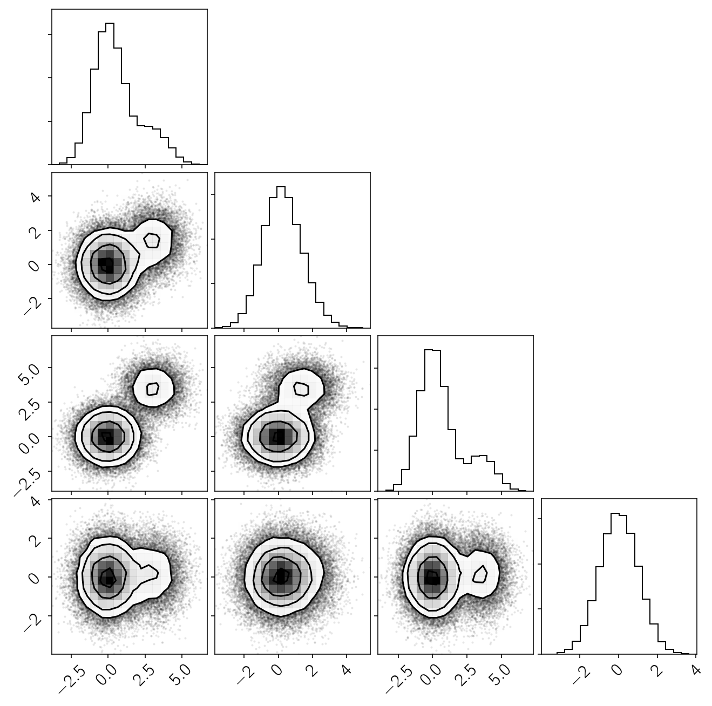

.. module:: george

.. note:: This page was generated from an IPython notebook that can be
          downloaded `here <https://github.com/dfm/corner.py/blob/master/docs/_static/notebooks/custom.ipynb>`_.

.. _custom:

Custom plotting
===============

It can sometimes be useful to add custom annotations or plot elements to
the output of ``corner.corner``. This tutorial shows how you can do
this.

For example, let's say that we want to overplot a few different values
for comparison. The ``truths`` interface isn't sufficient for supporting
this use case, so here's how you can do it.

First, let's generate some fake data with a mode at the origin and
another randomly sampled mode:

.. code:: python

    import corner
    import numpy as np
    
    ndim, nsamples = 4, 50000
    np.random.seed(1234)
    data1 = np.random.randn(ndim * 4 * nsamples // 5).reshape([4 * nsamples // 5, ndim])
    mean = 4*np.random.rand(ndim)
    data2 = (mean[None, :] + np.random.randn(ndim * nsamples // 5).reshape([nsamples // 5, ndim]))
    samples = np.vstack([data1, data2])
    
    figure = corner.corner(samples)

Now let's overplot the empirical mean of the samples and the true mean
of the second mode.

.. code:: python

    # This is the true mean of the second mode that we used above:
    value1 = mean
    
    # This is the empirical mean of the sample:
    value2 = np.mean(samples, axis=0)
    
    # Make the base corner plot
    figure = corner.corner(samples)
    
    # Extract the axes
    axes = np.array(figure.axes).reshape((ndim, ndim))
    
    # Loop over the diagonal
    for i in range(ndim):
        ax = axes[i, i]
        ax.axvline(value1[i], color="g")
        ax.axvline(value2[i], color="r")
        
    # Loop over the histograms
    for yi in range(ndim):
        for xi in range(yi):
            ax = axes[yi, xi]
            ax.axvline(value1[xi], color="g")
            ax.axvline(value2[xi], color="r")
            ax.axhline(value1[yi], color="g")
            ax.axhline(value2[yi], color="r")
            ax.plot(value1[xi], value1[yi], "sg")
            ax.plot(value2[xi], value2[yi], "sr")

.. image:: custom_files/custom_4_0.png

A similar procedure could be used to add anything to the axes that you
can normally do with matplotlib.

