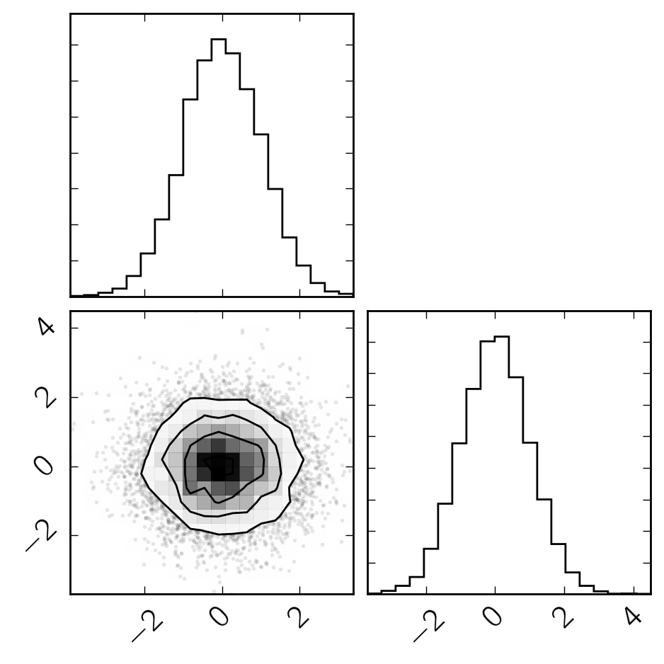
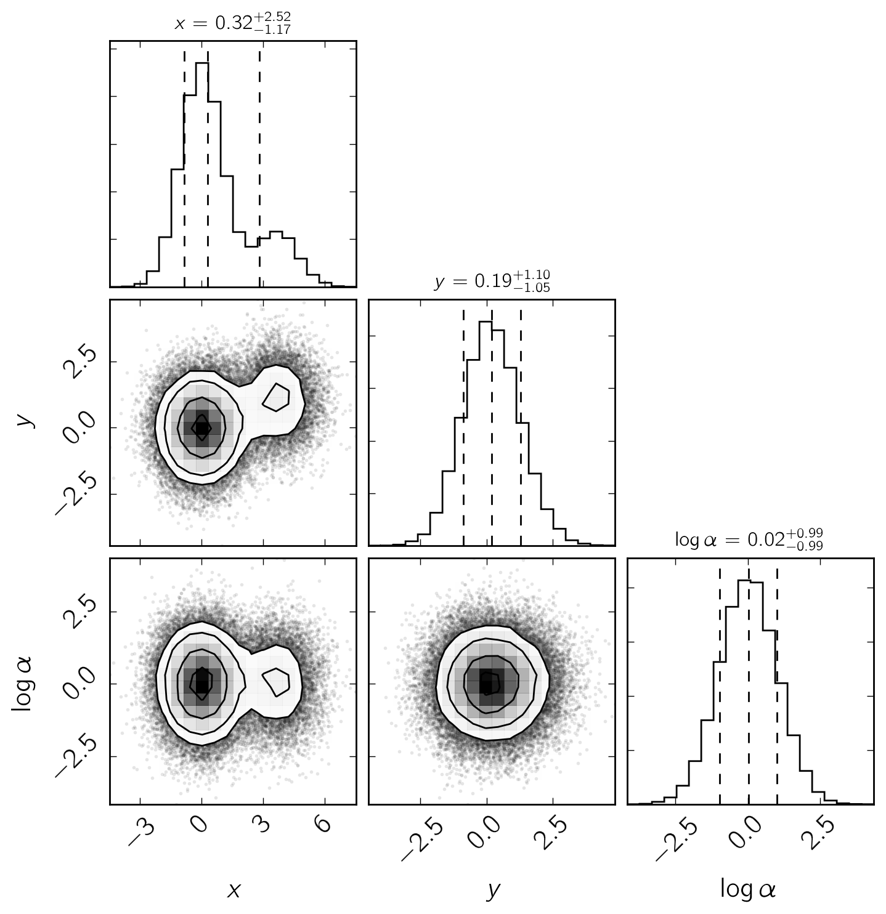

.. module:: george

.. note:: This page was generated from an IPython notebook that can be
          downloaded `here <https://github.com/dfm/corner.py/blob/master/docs/_static/notebooks/quickstart.ipynb>`_.

.. _quickstart:

Getting started
===============

The only user-facing function in the module is ``corner.corner`` and, in
its simplest form, you use it like this:

.. code:: python

    import corner
    import numpy as np
    
    ndim, nsamples = 2, 10000
    np.random.seed(42)
    samples = np.random.randn(ndim * nsamples).reshape([nsamples, ndim])
    figure = corner.corner(samples)

The following snippet demonstrates a few more bells and whistles:

.. code:: python

    # Set up the parameters of the problem.
    ndim, nsamples = 3, 50000
    
    # Generate some fake data.
    np.random.seed(42)
    data1 = np.random.randn(ndim * 4 * nsamples // 5).reshape([4 * nsamples // 5, ndim])
    data2 = (4*np.random.rand(ndim)[None, :] + np.random.randn(ndim * nsamples // 5).reshape([nsamples // 5, ndim]))
    data = np.vstack([data1, data2])
    
    # Plot it.
    figure = corner.corner(data, labels=[r"$x$", r"$y$", r"$\log \alpha$", r"$\Gamma \, [\mathrm{parsec}]$"],
                           quantiles=[0.16, 0.5, 0.84],
                           show_titles=True, title_kwargs={"fontsize": 12})

The `API documentation <../api.html>`__ gives more details about all the
arguments available for customization.

