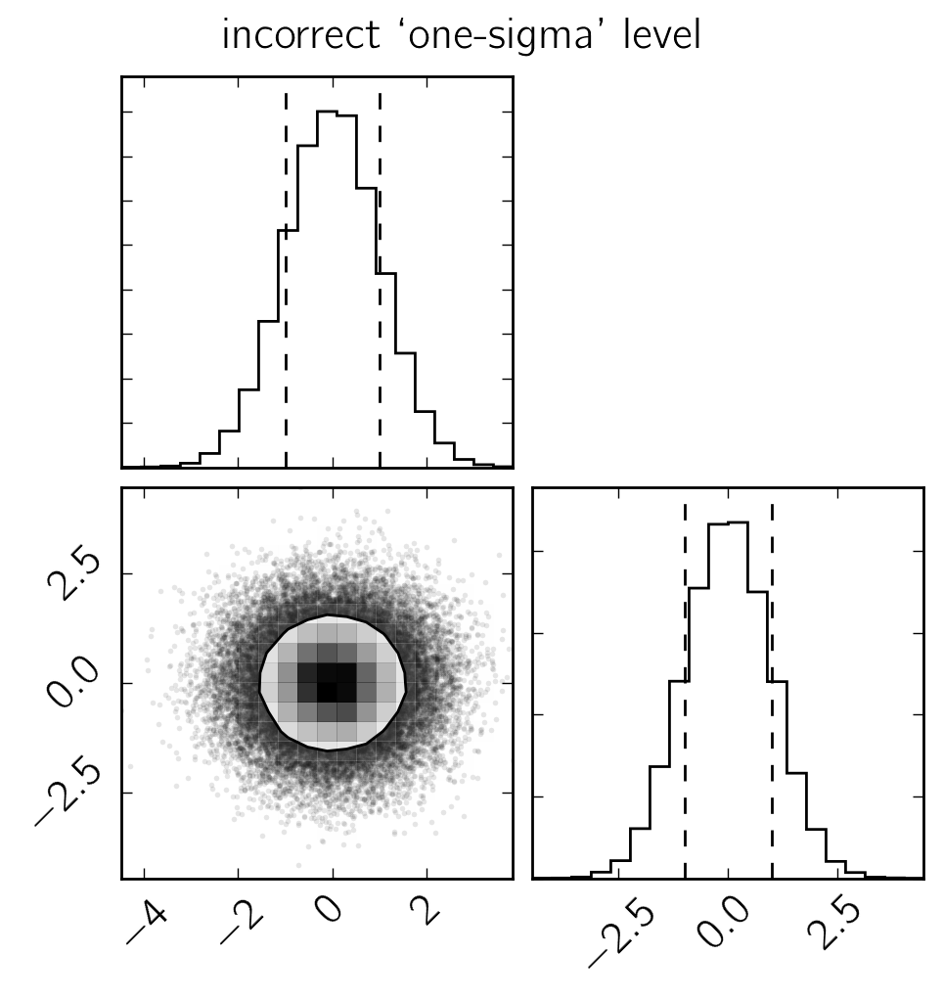

.. module:: george

.. note:: This page was generated from an IPython notebook that can be
          downloaded `here <https://github.com/dfm/corner.py/blob/master/docs/_static/notebooks/sigmas.ipynb>`_.

.. _sigmas:

A note about sigmas
===================

We are regularly asked about the "sigma" levels in the 2D histograms.
These are not the 68%, *etc.* values that we're used to for 1D
distributions. In two dimensions, a Gaussian density is given by:

::

    pdf(r) = exp(-(r/s)^2/2) / (2*pi*s^2)

The integral under this density (using polar coordinates and implicitly
integrating out the angle) is:

::

    cdf(x) = Integral(r * exp(-(r/s)^2/2) / s^2, {r, 0, x})
           = 1 - exp(-(x/s)^2/2)

This means that within "1-sigma", the Gaussian contains
``1-exp(-0.5) ~ 0.393`` or 39.3% of the volume. Therefore the relevant
1-sigma levels for a 2D histogram of samples is 39% not 68%. If you must
use 68% of the mass, use the ``levels`` keyword argument when you call
``corner.corner``.

We can visualize the difference between sigma definitions:

.. code:: python

    import corner
    import numpy as np
    import matplotlib.pyplot as pl

    # Generate some fake data from a Gaussian
    np.random.seed(42)
    x = np.random.randn(50000, 2)

First, plot this using the correct (default) 1-sigma level:

.. code:: python

    fig = corner.corner(x, quantiles=(0.16, 0.84), levels=(1-np.exp(-0.5),))
    fig.suptitle("correct `one-sigma' level");

.. image:: sigmas_files/sigmas_4_0.png

Compare this to the 68% mass level and specifically compare to how the
contour compares to the marginalized 68% quantile:

.. code:: python

    fig = corner.corner(x, quantiles=(0.16, 0.84), levels=(0.68,))
    fig.suptitle("incorrect `one-sigma' level");

